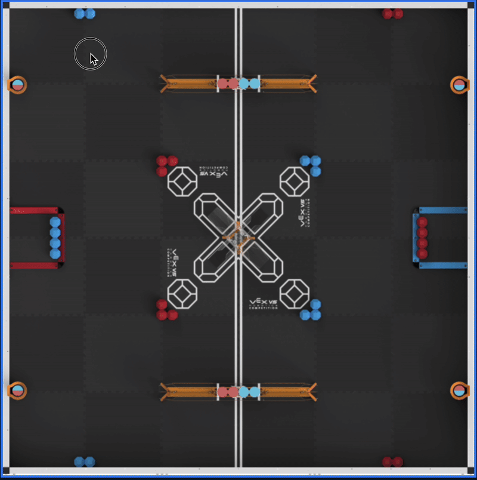
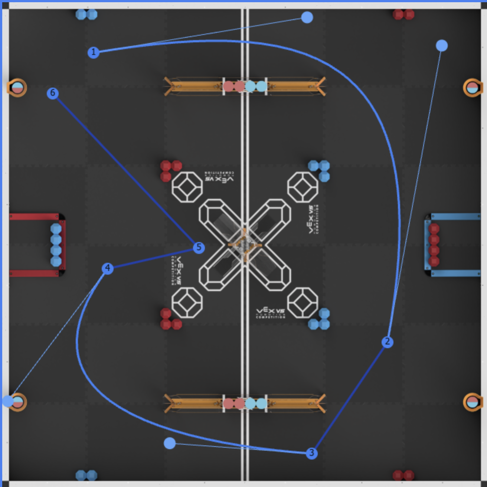

<!-- Banner Image -->

  
  
  
  
  

---

# VEX V5 Path Planner — ZED

A **visual path planning tool** designed for VEX V5 teams to easily create, edit, and visualize autonomous robot paths — no coding required.

---

## Table of Contents

- [Features](#features)
- [How to Use](#how-to-use)
- [Live Demo](#-live-demo)
- [Screenshots](#screenshots)
- [Download & Customize](#download--customize)
- [More Info & Website](#more-info--website)
- [Tutorial Video](#tutorial-video)
- [Built With](#built-with)
- [License](#license)
- [Community](#community)

---

## Features

- 🟢 **Add and drag waypoints** — left-click to add, drag to move  
- 🌀 **Toggle curves** — right-click to switch between straight and Bezier  
- 🛠️ **Edit curves** — drag control handles to fine-tune paths  
- 🤖 **Robot preview** — set robot size and simulate movement  
- ▶️ **Play animation** — real-time robot path animation  
- 💾 **Save/Load JSON** — export and import your custom paths

---

## How to Use

1. Click on the field to add waypoints.  
2. Drag waypoints or control handles to adjust the path.  
3. Right-click on segments to toggle curves.  
4. Set robot dimensions using the input fields.  
5. Press **Play** to start the path animation.  
6. Save your path to a JSON file or load a previously saved one.

---

## 🔥 Live Demo

  

---

## Screenshots

  

---

## Download & Customize

The full source code is available. Feel free to download, modify, and make it your own:

🔗 [https://github.com/Ashton254/VEX-V5-Push-Back-Path-Planer](https://github.com/Ashton254/VEX-V5-Push-Back-Path-Planer)

---

## More Info & Website

🌐 Use it online:  
[https://sites.google.com/view/vex-v5-path-planner/home?authuser=1](https://sites.google.com/view/vex-v5-path-planner/home?authuser=1)

---

## Tutorial Video

🎥 I’m creating a full walkthrough soon on my YouTube channel. Subscribe to stay updated:  
[https://www.youtube.com/channel/UC1oWpzjO2l_e_y2D8k62XoA](https://www.youtube.com/channel/UC1oWpzjO2l_e_y2D8k62XoA)

---

## Built With

- ⚙️ Vanilla JavaScript (no framework)
- 🧱 HTML5 + CSS3
- 🧠 Designed to be 100% frontend — no install or dependencies
- 📁 Just open `ZED-Path-planer.html` in your browser

---

## License

This project is licensed under the MIT License — see the [LICENSE](LICENSE) file for details.

---

## 🧑‍💻 Community

Want to give feedback, ask questions, or help out?

💬 Reach out via GitHub Issues  
🎥 Drop comments on my [YouTube channel](https://www.youtube.com/channel/UC1oWpzjO2l_e_y2D8k62XoA)

Discord server coming soon...

---

