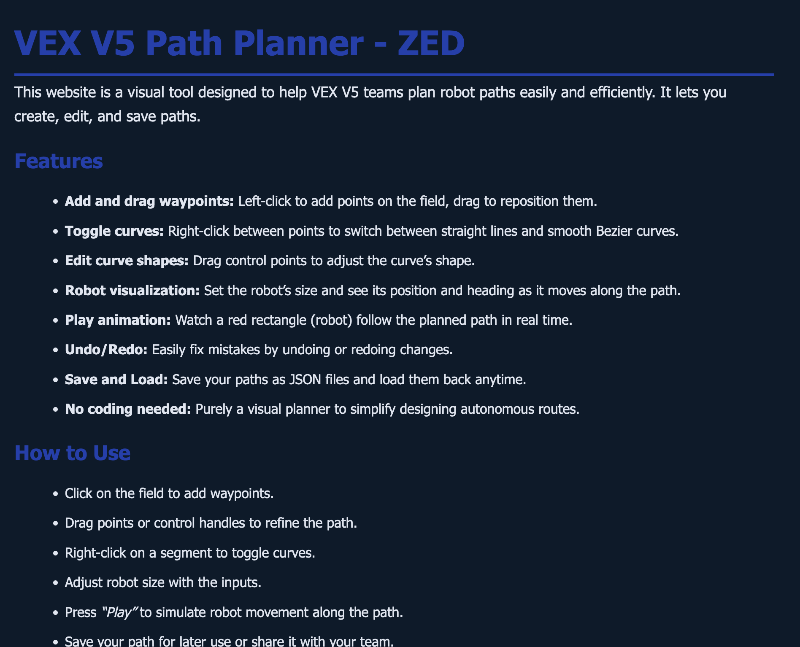

<!-- Logo and Badges -->

  
    
  
  
  
  
  
  

---

# ZED Path Planner

A **visual path planning tool** for VEX V5 teams. Build, animate, and refine autonomous paths — no coding required.

---

## 📚 Table of Contents

- [Features](#features)
- [How to Use](#how-to-use)
- [Screenshots](#screenshots)
- [Tutorial Video](#tutorial-video)
- [Website](#website)
- [Support](#support)
- [License](#license)

---

## 🚀 Features

- **Add and drag waypoints** – Left-click to add points, drag to move  
- **Bezier curves** – Right-click segments to toggle between straight/curved  
- **Control points** – Drag handles to fine-tune curve shapes  
- **Robot dimensions** – Customize size to match your actual robot  
- **Path animation** – Watch your bot drive the path in real-time  
- **Save/Load** – Save paths as JSON and reload them anytime  

[Back to top](#readme)

---

## 🕹 How to Use

1. **Click** to add waypoints  
2. **Drag** to reposition points and curve handles  
3. **Right-click** lines to switch between curve types  
4. **Set dimensions** for your robot using input fields  
5. **Click Play** to animate the robot along the path  
6. **Save** or **Load** JSON paths for later use

[Back to top](#readme)

---

## 📸 Screenshots

  
    
  

[Back to top](#readme)

---

## 📺 Tutorial Video

I'm creating a step-by-step tutorial soon — subscribe to my channel to stay updated:  
🎥 [YouTube Channel](https://www.youtube.com/channel/UC1oWpzjO2l_e_y2D8k62XoA)

[Back to top](#readme)

---

## 🌐 Website

Try it live here:  
🔗 [https://sites.google.com/view/vex-v5-path-planner/home](https://sites.google.com/view/vex-v5-path-planner/home)

[Back to top](#readme)

---

## 💖 Support

If ZED has helped your team, you can support the project:

- ⭐ Star the repo
- 💬 Join the [Discord server](https://discord.gg/gQxwtWSMk5)
- ☕ [Buy me a Ko-fi](https://ko-fi.com/your-username)

[Back to top](#readme)

---

## 📄 License

This project is licensed under the [MIT License](LICENSE).

[Back to top](#readme)

